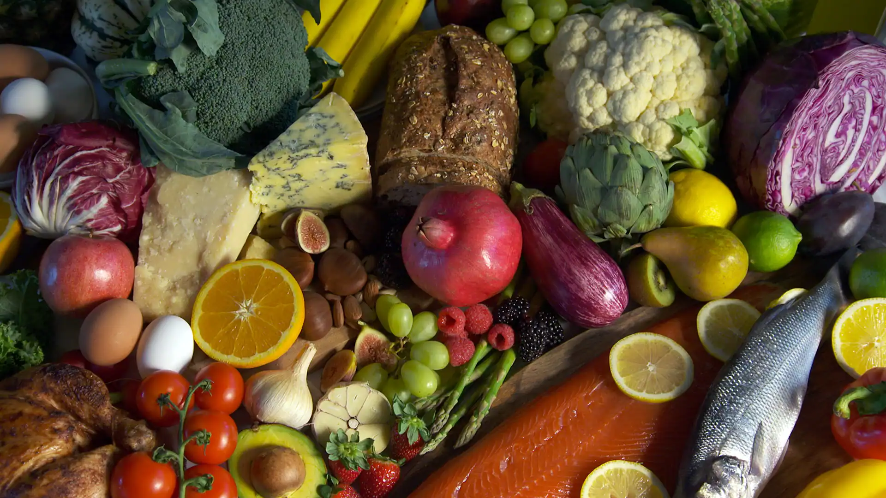

# Nutritional Analysis and Insights

## Introduction

This repository contains a comprehensive analysis of a dataset containing nutritional information for various food items. The goal is to uncover valuable insights and address key aspects of a competition challenge.

## Data Source

The nutritional data is sourced from USDA's FoodData Central [website](https://fdc.nal.usda.gov/download-datasets.html). The dataset contains the calorie content of 7,793 common foods, as well as their nutritional composition. Each row represents one food item, and nutritional values are based on a 100g serving.

## Data Description

- **FDC_ID**: A unique identifier for each food item in the database.
- **Item**: The name or description of the food product.
- **Category**: The category or classification of the food item.
- **Calories**: The energy content of the food, presented in kilocalories (kcal).
- **Protein**: The protein content of the food, measured in grams.
- **Carbohydrate**: The carbohydrate content of the food, measured in grams.
- **Total fat**: The total fat content of the food, measured in grams.
- **Cholesterol**: The cholesterol content of the food, measured in milligrams.
- **Fiber**: The dietary fiber content of the food, measured in grams.
- **Water**: The water content of the food, measured in grams.
- **Alcohol**: The alcohol content of the food (if any), measured in grams.
- **Vitamin C**: The Vitamin C content of the food, measured in milligrams.

## Usage

- Clone the repository: `git clone https://github.com/Sankalpa0011/Nutritional-Analysis-and-Insights.git`
- Navigate to the repository: `cd Nutritional-Analysis-and-Insights`
- View the analysis in Jupyter Notebook: `notebook.ipynb`
- View the dataset: `nutrition.csv`

## Credits

This analysis was conducted by Kavindu Sankalpa held on Radar DataCamp. The dataset is sourced from USDA's FoodData Central. Any additional resources used are credited appropriately within the analysis.
